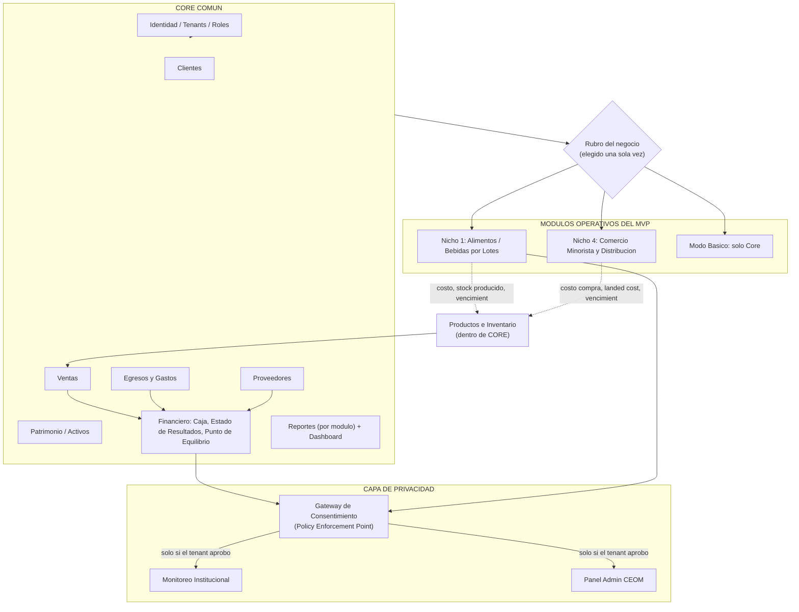
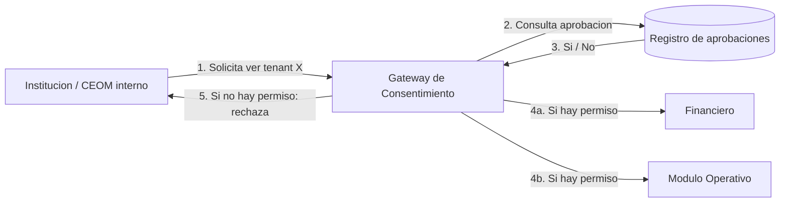

# CEOM-ERP — Arquitectura

> **Qué es este documento:** la única fuente de verdad sobre *por qué* CEOM está construido como está — el modelo Core/Nicho, los patrones que lo sostienen, el stack técnico y sus decisiones, y el contrato entre módulos. Consolida y **reemplaza** los cuatro documentos de la carpeta `pre-diseño/`:
> - `REPORTE-DE-DEFINICIÓN-ARQUITECTONICA-CEOM(antiguo).md` → superado. Su único aporte que se conserva (el análisis ERP horizontal/vertical/modular) está resumido en la sección 1.
> - `CEOM - Definicion Funcional de Módulos y Funcionalidades (v1).md` → superado por v2.
> - `CEOM - Definición Funcional de Módulos y Funcionalidades (v2 - Enfoque MVP...).md` → su contenido vigente (alcance del MVP) está integrado en la sección 2.
> - `CEOM - Arquitectura Modular (v3).md` → su contenido vigente (patrones, matriz de dependencias) está integrado en las secciones 5 y 6. Sus "preguntas abiertas" fueron revisadas contra `docs/modules/` y cerradas con el equipo — ver sección 8 (todas cerradas, ninguna pendiente).
>
> **Una vez que confirmes que este documento cubre lo que necesitás, podés borrar los 4 archivos de `pre-diseño/`.** El detalle funcional y técnico de cada módulo individual sigue viviendo en `docs/modules/Modulo_01...11.md` — este documento no lo duplica, lo referencia.

---

## 1. Por qué una arquitectura modular (y no un ERP genérico ni uno de nicho puro)

Antes de tener un solo emprendimiento como cliente, existían tres caminos posibles en la industria de ERPs:

| Modelo | Ejemplos | Por qué no sirve para CEOM |
|---|---|---|
| **ERP horizontal genérico** | Holded, QuickBooks, SAP Business One | No entiende recetas, mermas, ni lotes — el emprendedor de producción termina llevando un Excel paralelo. |
| **ERP vertical de nicho puro** | Revo, Toast | Resuelve un solo rubro al 100%, pero expandir a otro rubro exige clonar o reescribir el proyecto entero. |
| **ERP modular extensible (CEOM)** | Odoo, SAP Enterprise Modular | Un Core financiero/comercial agnóstico al rubro + Módulos Operativos especializados que se activan según el nicho del negocio. |

La decisión es un **Core Común** (igual para cualquier rubro) más **Módulos Operativos Conmutables** (uno se activa por tenant, según su nicho). El costo de esta decisión es real —requiere disciplina de diseño desde el día uno (contratos explícitos, aislamiento entre módulos)— pero es lo que permite que un error de lógica textil nunca tumbe la facturación de una heladería, y que sumar un rubro nuevo no obligue a tocar el Core.

---

## 2. Alcance vigente: qué se construye ahora (MVP) y qué queda para después

**Entra en el MVP:**
- Core Común completo: Identidad/Tenants, Clientes, Ventas, Egresos y Gastos, Proveedores, Patrimonio, Financiero, Reportes.
- **Nicho 1 — Alimentos y Bebidas por Lotes** (prioridad más alta: caso validado SanttiCampo).
- **Nicho 4 — Comercio Minorista y Distribución.**
- **Modo Básico** (negocio sin nicho asignado, solo usa el Core).
- **Gateway de Consentimiento + Panel Institucional + Panel de Administración CEOM**, a nivel funcional básico — esto se construye desde el MVP porque es un tema de privacidad, no un "extra" postergable (ver sección 5.2).

**Se posterga deliberadamente (no es deuda técnica, es alcance fuera de este ciclo):**
- Catálogo Comercial Digital + venta por WhatsApp (el costo de la API de WhatsApp encarece la suscripción para el segmento objetivo de emprendimientos pequeños).
- Tuki IA Engine (motor transversal de alertas y sugerencias).
- Pilar de Acompañamiento (asesores humanos) — se evalúa al final del MVP, si el tiempo lo permite.
- Pilar de Educación (CEOM EDU).
- Nicho 2 (Gastronomía de Ensamblaje), Nicho 3 (Confección Textil).
- Nicho 5 (Servicios por Cita/Hora) — **descartado** para esta etapa, no solo pospuesto: CEOM es un ERP que sigue un proceso operativo con inventario/producción; un negocio de servicios por hora no tiene ese proceso, forzarlo ahora sería construir algo fuera del núcleo del producto.

**Fuera de alcance de todo este documento** (se dan por sentados en el diseño, se documentan en `docs/modules/Modulo_01` y en `docs/production/` más adelante): autenticación y sesión, checkout/planes/cobros, infraestructura de multi-tenancy a nivel de infraestructura (sí está resuelta a nivel de modelo de datos — ver sección 6.4).

---

## 3. Principios rectores del producto

1. **El Core nunca sabe de negocio.** Nada de lógica de "receta", "landed cost" o "vencimiento por lote" vive en el Core — vive exclusivamente en el Módulo Operativo del nicho correspondiente.
2. **Todo dato operativo termina en un número financiero**, sin doble transcripción manual. Una producción, una compra, una merma: se reflejan automáticamente en Financiero.
3. **Un negocio, un Nicho.** No hay multiplicidad de nichos activos por tenant (los casos de "también revendo algo sin transformarlo" se resuelven con el flag `tipo_origen_producto = reventa_simple` dentro del mismo nicho — ver Módulo 2, sección 6 — **ya no es una pregunta abierta**, está cerrado).
4. **Privacidad por defecto.** Ningún tercero —institución, ni siquiera el propio equipo de CEOM— ve el detalle de un emprendimiento sin que ese emprendimiento lo haya aprobado explícitamente. CEOM no tiene acceso privilegiado por ser dueño de la plataforma.
5. **Multi-perfil desde el diseño.** Owner, colaborador, institución y equipo CEOM interno ven el mismo negocio con distinto nivel de detalle, gobernado por el mismo motor de autorización (Módulo 1) y el mismo Gateway de Consentimiento.
6. **Cero fricción, primero.** Onboarding progresivo — lo avanzado se revela cuando hace falta, no se impone desde el día uno.

---

## 4. Vista de alto nivel (alcance del MVP)

**Lectura:** el Core es el mismo esquema de base de datos para todos los tenants. En el onboarding, el negocio elige su rubro una sola vez y se activa un único Módulo Operativo (o Modo Básico). Los módulos de nicho nunca duplican Ventas, Gastos ni Clientes — solo generan eventos que el Core consume. Ningún consumidor externo (Monitoreo Institucional, Panel Admin CEOM) lee un módulo de datos directamente: siempre pasa primero por el Gateway.

---

## 5. Patrones arquitectónicos aplicados

El propio diseño funcional ya usa patrones estándar de la industria, sin nombrarlos explícitamente — vale la pena que el equipo (humano y agentes) los reconozca por su nombre, para no reinventarlos mal ni desviarse de ellos sin darse cuenta.

### 5.1 Strategy Pattern — Módulo Operativo por nicho

Una interfaz común ("Operaciones") con una implementación distinta por rubro (Nicho 1: recetas y lotes; Nicho 4: órdenes de compra y landed cost). El Core (Productos e Inventario) depende de la interfaz abstracta, nunca de una implementación concreta — así se cumple *Liskov Substitution* (cualquier nicho es intercambiable sin romper el Core) y *Dependency Inversion*.

### 5.2 Policy Enforcement Point (Gateway de Consentimiento)

El problema: varios módulos (Financiero, Operaciones, Inventario) necesitan poder ser vistos por un tercero, pero solo si el tenant lo aprobó explícitamente. Si esa regla se implementa dentro de cada módulo, se viola *Single Responsibility* y se duplica lógica de permisos en varios lugares.

La solución: un módulo único —**Gateway de Consentimiento**— que:
1. Es el único lugar donde vive la regla de aprobación.
2. Actúa como intermediario obligatorio: ningún consumidor externo lee un módulo de datos directamente, siempre pregunta primero al Gateway.
3. Cumple *Open/Closed*: agregar un nuevo tipo de consumidor (ej. futuro Panel de Auditoría) no requiere tocar Financiero, Operativo ni Inventario — solo se lo registra como otro cliente del Gateway.

Autoriza **por módulo consultado**, no en bloque: una institución puede tener aprobado ver solo Financiero, sin ver Operativo.

### 5.3 Ledger / append-only (nunca editar un saldo)

Stock, Ventas y Financiero nunca editan un saldo directamente — insertan un movimiento y el saldo se deriva:
- `cantidad_actual` de Stock se recalcula desde `MovimientoStock`, nunca se edita a mano.
- Toda venta congela `precio_venta_snapshot` y `costo_unitario_snapshot` en el momento de la transacción; correcciones posteriores pasan por un `AjusteVenta` con motivo obligatorio, nunca por edición directa.

Esta regla es la que más vale la pena dejar explícita en las reglas para agentes (`AGENTS.md`), porque la tentación natural de un LLM generando CRUD es hacer un `UPDATE` directo sobre el saldo.

### 5.4 Repository pattern (a nivel de código, no solo de diseño)

Cada módulo encapsula el acceso a sus propias tablas detrás de una capa delgada de funciones públicas (`consultar_stock()`, `consultar_precio_venta()`, etc.). Ningún módulo importa el repository de otro módulo directamente — solo consume sus salidas expuestas. Esto traslada al código la regla de diseño "cada módulo es una caja negra".

### 5.5 SOLID, resumido a una fila por principio

| Principio | Cómo aparece en el diseño |
|---|---|
| Single Responsibility | Cada módulo tiene una responsabilidad explícita ("Qué hace" / "Qué NO hace" en `docs/modules/`) |
| Open/Closed | Gateway de Consentimiento: nuevo consumidor no toca Financiero ni Operativo |
| Liskov Substitution | Cualquier implementación de "Operaciones" (nicho) es intercambiable |
| Interface Segregation | Cada módulo expone solo lo que sus consumidores necesitan, no su modelo interno completo |
| Dependency Inversion | Productos e Inventario depende de la interfaz "Operaciones", no de un nicho concreto |

---

## 6. Arquitectura técnica

### 6.1 Stack

| Capa | Decisión |
|---|---|
| Frontend + backend | Next.js (App Router), TypeScript, Server Actions / Route Handlers |
| Base de datos | PostgreSQL vía Supabase |
| Autenticación | Supabase Auth (GoTrue) — el `id` de Usuario coincide con el `id` de Supabase Auth |
| Storage de archivos | Supabase Storage (backend Backblaze B2) |
| Hosting — desarrollo | Vercel (frontend) + Supabase Cloud (backend) |
| Hosting — producción (objetivo) | VPS propio (Contabo), Supabase self-hosted vía Docker + frontend en el mismo VPS |
| Gestor de paquetes | pnpm |

### 6.2 Capa de acceso a datos — decisión y por qué

**Decisión: Drizzle ORM + Drizzle Kit para el esquema y las migraciones; `supabase-js` reservado únicamente para Auth, Storage y Realtime — nunca para las queries de negocio de un módulo.**

Esta decisión se toma priorizando dos cosas explícitamente pedidas: seguridad, y portabilidad entre el entorno de desarrollo (Supabase Cloud) y el de producción (Supabase self-hosted en el VPS).

- **Seguridad:** Drizzle tiene soporte nativo de Row Level Security (helpers `crudPolicy()`), lo que permite declarar las políticas de RLS **junto al esquema, en el mismo código TypeScript versionado y revisable en cada Pull Request** — en vez de vivir como SQL suelto que nadie termina revisando. En un sistema multi-tenant donde el aislamiento por `tenant_id` es la barrera de seguridad principal (ver sección 6.4), esto es la diferencia entre una política de seguridad que se revisa como código y una que se olvida.
- **Portabilidad dev → producción:** Supabase Cloud y Supabase self-hosted son, debajo, el mismo PostgreSQL. Drizzle Kit genera las migraciones como archivos `.sql` planos — corren idénticas en los dos entornos, sin un motor de migración propietario de por medio que pueda comportarse distinto entre un Postgres gestionado y uno self-hosted (a diferencia de Prisma, cuyo motor de migración puede chocar con roles/extensiones que Supabase ya precrea, un problema documentado específicamente en el camino de migración a self-host).
- Costo de esta decisión: Drizzle es más cercano a SQL y menos "mágico" que Prisma — el equipo (humano y agentes) escribe queries más explícitas. Se considera un costo aceptable a cambio de la portabilidad y del control de RLS como código.

### 6.3 Testing

Vitest (unitarios/integración) + Testing Library, Playwright (end-to-end). Vitest es hoy el estándar de facto para proyectos Next.js — nativo en ESM/TypeScript sin configuración adicional, y su modo watch es sensiblemente más rápido que Jest, lo que importa para el flujo de iteración con agentes (correr tests después de cada cambio pequeño). El detalle de configuración va en `docs/dev-practices/` cuando se aborde esa carpeta.

### 6.4 Multi-tenancy y aislamiento (transversal a todos los módulos)

- Aislamiento a **nivel de aplicación**, no de esquemas separados: toda tabla de negocio lleva `tenant_id`, toda query lo filtra, reforzado con RLS en la base de datos (no solo en el código de la aplicación — ver 6.2).
- Soft delete siempre (`eliminado_en`); nunca `DELETE` físico salvo pedido explícito.
- `Sucursal` existe desde el día uno en el modelo de datos aunque el plan básico no la exponga en la interfaz — evita una migración de datos el día que el negocio compre el plan multi-sucursal.

---

## 7. Matriz de dependencias entre módulos

| Módulo | Depende de | Es consumido por |
|---|---|---|
| Identidad / Tenants / Roles | — | Todos los demás módulos |
| Productos e Inventario | Módulo Operativo (si existe), Proveedores (reventa directa), Ventas (descuento) | Ventas, Operaciones |
| Operaciones (nicho) | Productos e Inventario, Inventario Operativo, Capacidad Operativa | Productos e Inventario, Financiero (vía COGS en Ventas) |
| Inventario Operativo | Proveedores/Compras, Operaciones | Operaciones |
| Capacidad Operativa | Patrimonio | Operaciones |
| Patrimonio / Activos | — | Capacidad Operativa |
| Proveedores / Compras | Insumos (Nicho 1), Productos (Módulo 2) — FK real de `Compra.insumoId`/`productoId` | Inventario Operativo (`registrarEntradaCompraInsumo`), Productos e Inventario (`registrarEntradaCompraReventa`), Financiero — **caller real desde roadmap ítem #12**, no solo teórico |
| Nicho 4 (`src/modules/operativo/nichos/nicho-4/`) | Patrimonio (`consultarCapacidad`), Productos e Inventario (`consultarStockTotalPorSucursal`), Operativo Nicho 1 (`calcularPorcentajeCapacidadUsada`, pura) | — |
| Ventas | Productos e Inventario | Clientes, Costos y Gastos (comisión automática), Financiero |
| Clientes | Ventas (evento) | — |
| Egresos y Gastos | Proveedores (opcional, ficha) | Financiero |
| Financiero | Ventas, Gastos, Proveedores/Compras | Gateway de Consentimiento |
| Gateway de Consentimiento | — | Monitoreo Institucional, Panel Admin CEOM |
| Monitoreo Institucional (`src/modules/monitoreo-institucional/`) | Gateway (`tieneConsentimiento`, `listarCarteraPropia`), Identidad (`obtenerTenantParaVeedor`, `solicitanteGateway`), Financiero, Ventas, Operaciones (mediado por Gateway) | — |
| Panel Admin CEOM (`src/modules/panel-admin-ceom/`) | Identidad (`listarTenants`, `obtenerTenantPorId`, bypass `ceom_admin` de `tienePermiso`), Gateway (`registrarAccesoAdminCeom`), Suscripción (`listarPlanes`), Financiero, Operaciones (acceso directo, no mediado por Gateway — regla 4.5 del Módulo 11) | — |
| Simulaciones (`src/modules/simulaciones/`) | Ventas (`consultarUnidadesVendidasPeriodo`), Productos e Inventario (`consultarCostoOperativo`, `consultarPrecioVenta`, `listarProductos`), Financiero (`costoFijoTotal`, `calcularMargenPorcentaje` — pura, reutilizada) | — |
| Reportes | Todos los módulos (solo lectura, agregación) | — |

---

## 8. Preguntas abiertas — todas cerradas

Las versiones anteriores dejaban una lista de preguntas abiertas. Al revisarlas contra el detalle ya cerrado en `docs/modules/`, la mitad ya estaban resueltas ahí; las dos que seguían genuinamente abiertas se cerraron con el equipo. Con esto, la arquitectura queda sin pendientes de diseño.

| Pregunta | Estado |
|---|---|
| ¿El `costo_unitario_snapshot` se congela junto con el precio de venta vigente? | **Cerrada.** Sí — doble snapshot confirmado en Módulo 3, sección 3: cambios posteriores al producto no tocan ventas ya registradas. |
| Migración de Modo Básico a un Nicho: ¿se autoasignan los productos ya cargados? | **Cerrada.** No se autoasignan — el Owner vincula explícitamente ("Vincular a proceso operativo") en el Módulo 2. Confirmado también como caso especial del Módulo 1 (sección 9.7). |
| Reventa simple dentro de un Nicho de producción | **Cerrada.** Resuelto con el flag `tipo_origen_producto = reventa_simple` (Módulo 2, sección 6). |
| **Consentimiento granular** | **Cerrada — revisada en Fase 1.** Ver decisión detallada en 8.1. Al construir el Módulo 10 (Gateway) se confirmó con el modelo de datos ya existente en Módulo 11 (`planes.modulos_veedor_permitidos`) que la granularidad real es **por módulo veedor** (`financiero`/`operativo`/`inventario_operativo`), no por función expuesta individual — reemplaza la decisión original de esta sección. |
| **Capacidad Operativa sin nicho activo** | **Cerrada.** El dato queda simplemente sin uso hasta que el negocio tenga un Módulo Operativo activo que lo consulte. Productos e Inventario **no** lo consulta directamente — mantiene la responsabilidad de ese módulo acotada a precio/stock/catálogo, sin absorber una función que conceptualmente pertenece a la relación Patrimonio↔Operaciones. Si en el futuro aparece un caso real que lo justifique (ej. un negocio de reventa con límite físico de almacenamiento), se evalúa como una extensión puntual, no como la regla general. |
| Reglas de Proveedores vs. Órdenes de Compra por nicho | **Cerrada — revisada en Fase 1.** Ver decisión detallada en 8.2. Al construir el Módulo 12 (Nicho 4) se confirmó con el usuario que la Orden de Compra **no** es una entidad propia del nicho — reemplaza la decisión original de esta sección. |

### 8.1 Consentimiento granular — nivel resuelto (revisado al construir el Gateway)

**Esta sección reemplaza la decisión original** (autorizar por función expuesta individual). Al construir el Módulo 10 (Gateway de Consentimiento), el modelo de datos ya existente en Módulo 11 —`planes.modulos_veedor_permitidos`, con el enum `modulo_veedor` (`financiero`/`operativo`/`inventario_operativo`)— ya fijaba de hecho la unidad de concesión en el módulo veedor, no en la función individual. Construir un segundo nivel de granularidad por función habría requerido un modelo de datos que nunca se llegó a diseñar (¿qué funciones exactas son "veedor-seguras" en cada módulo, y quién mantiene esa lista sincronizada con `docs/modules/`?) — se optó por no introducirlo sin un caso real que lo justifique.

- El contrato real del Gateway es `tieneConsentimiento(institucionId, tenantId, moduloVeedor) → boolean`, donde `moduloVeedor` es uno de los 3 valores del enum `modulo_veedor` (`src/modules/consentimiento/schema.ts`), no una función individual.
- La aprobación del tenant (`aprobaciones_tenant.modulos_aprobados`) es un array de `modulo_veedor` — un tenant puede aprobar `financiero` sin aprobar `operativo`, pero no puede aprobar `financiero.estado_resultados` sin `financiero.punto_equilibrio`: dentro de un módulo veedor aprobado, todas sus funciones expuestas quedan visibles.
- **Consecuencia práctica real (Monitoreo Institucional, roadmap ítem #11):** varias consultas de detalle (capacidad operativa, stock de insumo, margen por producto) quedaron fuera de alcance por necesitar IDs que ningún módulo veedor-seguro expone hoy (`activoId`, `sucursalId`, `productoId`) — un problema que un segundo nivel de granularidad por función no habría evitado, porque el gap es de qué IDs son seguros de exponer a un tercero, no de la unidad de aprobación.
- Si en el futuro aparece un caso real que exija negar una función puntual dentro de un módulo ya aprobado, se evalúa como extensión del modelo de datos de `aprobaciones_tenant` en ese momento — no se fuerza hoy sin ese caso concreto.

### 8.2 Proveedores vs. Órdenes de Compra — jerarquía resuelta (revisada al construir Nicho 4)

**Esta sección reemplaza la decisión original** (Orden de Compra como entidad propia de Nicho 4, fuente de verdad, referenciando a un Proveedor). Al construir el Módulo 12 (Nicho 4, roadmap ítem #12) se confirmó con el usuario una jerarquía más simple:

- **No existe una entidad "Orden de Compra" separada.** `Compra` (Proveedores, Core) ganó un campo `estado` (`pedido`/`recibido`, default `recibido`) y `costoAdicionalTraslado` — el ciclo "pedido → recibido" que Nicho 4 necesita (landed cost, fecha de recepción real) es un estado dentro de la misma tabla `Compra`, no una tabla nueva.
- **Proveedores (Core) sigue siendo dueño de toda la transacción de compra**, en cualquier nicho — costo, cantidad, landed cost, estado de pago. `recibirCompra()` (Proveedores) es lo que dispara la entrada real de stock (`registrarEntradaCompraReventa`/`registrarEntradaCompraInsumo`) al pasar de `pedido` a `recibido`.
- **`src/modules/operativo/nichos/nicho-4/` no tiene lógica de compras** — solo expone `consultarCapacidadAlmacenamientoUsada` (cruza stock real de Productos contra la capacidad de un Activo de Patrimonio). No hay Strategy Pattern simétrico completo con Nicho 1 en este punto: el dominio de Nicho 4 no lo necesita, es una decisión confirmada, no una implementación a medias.
- **En nichos sin ese ciclo `pedido`/`recibido`** (Nicho 1, Modo Básico), `Compra` nace directamente en `recibido` (el default) — mismo modelo de datos, sin un paso de aprobación extra, coherente con "cero fricción, primero".
- Esta jerarquía es la que se implementó en el Módulo 8 (Proveedores) extendido por el roadmap ítem #12 — ver `src/modules/proveedores/ANCLA.md` y `src/modules/operativo/nichos/nicho-4/ANCLA.md`.

### 8.3 Identidad de Institución — por qué NO es un Usuario de tenant (decisión de arquitectura, no solo de UI)

**Contexto:** `/portal` (Módulo 10, Gateway de Consentimiento) necesitaba una forma de que una
Institución vuelva a entrar después del primer canje de Código de Acceso, sin repetir el código
cada vez. Modulo_01 sección 10 ya fija el criterio técnico único de autenticación del proyecto
("delegada a Supabase Auth, no se construye un sistema propio, `Usuario.id` coincide con el `id`
de Supabase Auth") — la pregunta de diseño real era **cómo aplicar ese mismo criterio a una
identidad que no es un Usuario de ningún tenant**, sin forzarla a encajar en el modelo de Usuario.

**Decisión: Institución tiene su propio mecanismo de sesión, deliberadamente separado del de
Usuario — no una variante ni una extensión de `tienePermiso()`/`obtenerUsuarioActual()`.**

- **`instituciones.id` sigue siendo su propio PK, independiente de Supabase Auth.** A diferencia
  de Usuario (donde la fila en `usuarios` nunca existe sin que exista antes su identidad en
  Supabase Auth), una Institución puede existir mucho antes de tener una identidad de Auth — alta
  manual por `ceom_admin` sin email, o auto-alta al canjear un código sin completar nunca el magic
  link. Se agregan dos columnas nullable en su lugar: `email` y `auth_user_id` (FK a
  `auth.users.id`, único), vinculadas **de forma perezosa**: recién en el primer magic link
  exitoso, el sistema busca una Institución con ese email sin `auth_user_id` todavía, y completa
  el vínculo ahí. Forzar `id = auth.users.id` habría exigido reescribir un PK ya referenciado por
  FK desde 4 tablas (`cartera_institucional`, `solicitudes_seguimiento`, `aprobaciones_tenant`,
  `codigos_acceso.institucionId`) en el momento del vínculo — costo real sin beneficio.
- **`tienePermiso()` no reconoce Institución, y no debe hacerlo.** Sigue siendo exclusivo de
  `UsuarioConRol` (un Usuario de un tenant específico). El Gateway de Consentimiento ya tiene su
  propia función de autorización, deliberadamente separada: `tieneConsentimiento(institucionId,
  tenantId, moduloVeedor)` (sección 5.2/8.1), que nunca recibe `solicitante: UsuarioConRol` — fue
  diseñada desde el Módulo 10 para ser llamada por una parte externa sin cuenta CEOM. Institución
  no necesita "colarse" en el motor de Usuario; ya tiene el suyo.
- **El "reconocimiento" de una Institución autenticada es `obtenerInstitucionActual()`**
  (`src/modules/consentimiento/actions.ts`) — el análogo exacto de `obtenerUsuarioActual()`
  (Identidad), pero resolviendo contra `instituciones.auth_user_id` en vez de `usuarios.id`. Vive
  en Consentimiento, no en Identidad, porque Institución es una tabla propia de ese módulo (regla
  de caja negra, sección 5.4).
- **El aislamiento entre las dos identidades ya existe por construcción, verificado explícitamente
  (no solo asumido):** si una sesión de Institución llega a golpear `/app` o `/admin`,
  `obtenerUsuarioActual()` busca en `usuarios` por `id = auth.uid()` y no encuentra nada (una
  Institución nunca tiene fila ahí) — devuelve `null`, y cada `layout.tsx` protegido ya redirige a
  `/login`. Y viceversa: `obtenerInstitucionActual()` nunca resuelve una sesión de Usuario, porque
  busca por `auth_user_id` en `instituciones`, tabla donde un Usuario tampoco tiene fila. No hizo
  falta ningún cambio de código para lograr este aislamiento — la propiedad ya se sostenía sola por
  cómo están modeladas las dos tablas; queda documentada acá para que un agente futuro no tenga que
  re-descubrirla leyendo código.
- **RLS no participa de este mecanismo.** Toda lectura/escritura de negocio del proyecto pasa por
  el rol `postgres` vía Drizzle (sección 6.2), nunca por el rol `authenticated` de Supabase — la
  sesión de Institución solo se usa para leer `auth.getUser()`/`exchangeCodeForSession()`, nunca
  para consultar tablas de negocio directamente.
- **Anti-enumeración deliberada:** pedir un magic link para un email sin Institución asociada
  nunca crea un usuario de Supabase Auth ni revela si el email existe — el mensaje al usuario final
  es siempre el mismo, sin importar el resultado real (mismo criterio de no filtrar información por
  un canal lateral que ya sigue el resto del proyecto en sus mensajes de error).

Detalle de implementación completo (columnas, migración, Route Handler del callback, tests):
`src/modules/consentimiento/ANCLA.md`.

---

## 9. Estado de este documento

**La arquitectura queda cerrada**: sin preguntas de diseño pendientes (sección 8) y con la decisión técnica de capa de acceso a datos ya tomada (sección 6.2). A partir de acá, cualquier ajuste a este documento debería surgir de algo que se descubra recién al construir un módulo — no de un diseño que faltaba definir.

## 10. Qué documentar después de este archivo (pendiente, no ahora)

Ya identificado y en espera de que se aborde explícitamente:
- `docs/dev-practices/` — reglas para agentes (`AGENTS.md`), flujo de trabajo módulo por módulo, convención de `ANCLA.md` por módulo, configuración de Vitest/Playwright/GitHub Actions.
- `docs/production/` — runbook de VPS Contabo, migración Supabase Cloud → self-hosted, backups.
- `docs/roadmap/` — orden de construcción de módulos con checkboxes, como documento vivo.

Este documento de arquitectura es la base sobre la que se escriben esos tres — se vuelve a él cada vez que una decisión de esos documentos necesite justificarse contra el diseño.