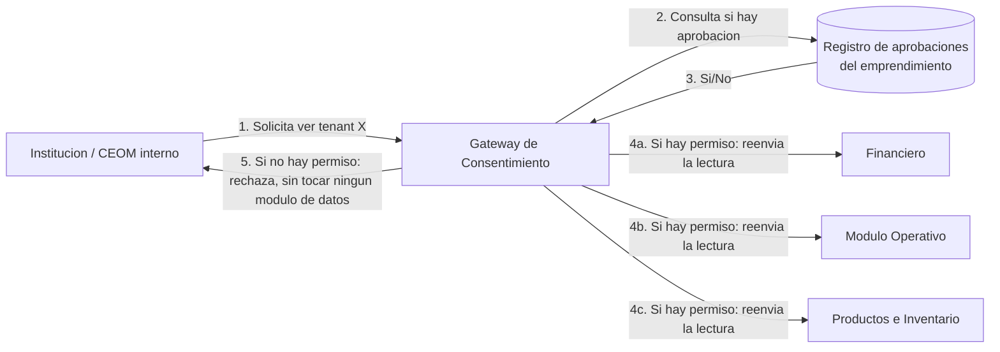
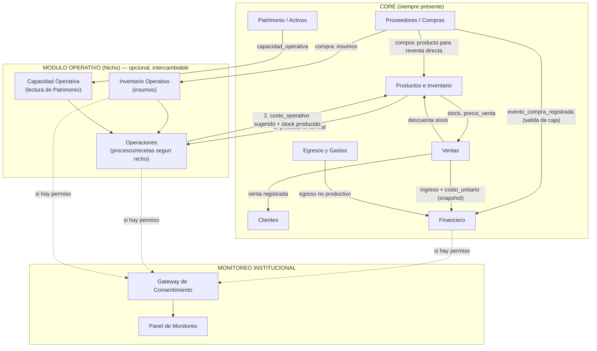
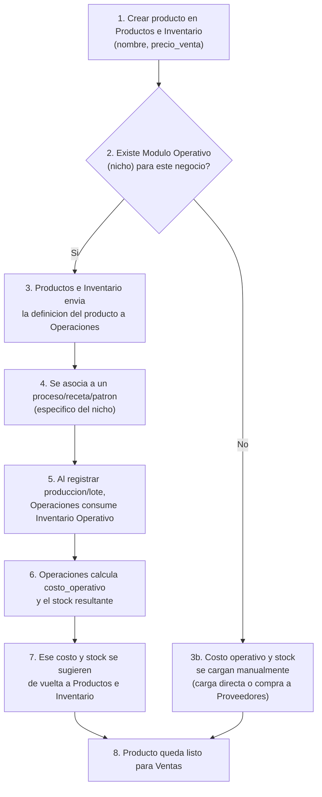

# CEOM — Arquitectura Modular (v3): Módulo Operativo Desacoplado y Gateway de Consentimiento

> **Origen de esta versión:** parte del diagrama propuesto por el equipo de CEOM (Productos e Inventario, Módulo Operativo, Proveedores, Ventas, Clientes, Módulo Financiero, Monitoreo Institucional) y de las correcciones acordadas en la ronda de revisión. Reemplaza la propuesta de contratos de la iteración anterior en los puntos donde hubo cambio; se mantiene el mismo principio de fondo: **cada módulo es una caja negra con un contrato de entrada/salida explícito**, testeable en aislamiento.
>
> **Fuera de alcance** (igual que en documentos previos): autenticación, checkout/planes/cobros, infraestructura multi-tenant.

---

## 1. Qué cambia respecto a la iteración anterior

| Punto | Antes | Ahora |
|---|---|---|
| **Patrimonio / Activos** | Vivía dentro del Módulo Operativo (Nicho) | Vuelve al **Core**, como registro general de activos. El Módulo Operativo solo **lee** `capacidad_operativa` cuando la necesita — un negocio sin nicho o en Nicho 4 también puede tener activos. |
| **Proveedores** | Pensado solo como "compra de insumos para el nicho" | Se generaliza a **compras en general**: insumos (→ Módulo Operativo) o producto terminado para reventa directa sin transformación (→ Productos e Inventario). Cubre el caso de reventa sin nicho (ej. venta de carteras por TikTok). |
| **Proveedores → Financiero** | Conexión directa sin distinguir de qué se trataba | Se aclara que es el registro de la **salida de caja al pagar la compra** (para Flujo de Caja), **distinto** del costo operativo/COGS, que se reconoce recién cuando el producto se vende. |
| **Costo operativo vs. Precio de venta** | Implícito | Se formaliza como dos campos separados con dueños distintos: el precio de venta lo define siempre Productos e Inventario; el costo operativo lo *sugiere* el Módulo Operativo (si existe) o se carga manual (si no existe). |
| **Consentimiento (Monitoreo Institucional)** | Regla repartida / flag por módulo | Se resuelve con un **patrón de Gateway de Autorización** (ver sección 2) — módulo único, reutilizable también para el futuro Panel de Administración interna de CEOM. |
| **Reportes** | Módulo propio | Se elimina como módulo de datos. Cada módulo expone sus propios reportes/exportaciones. El **Dashboard** es una capa de presentación que compone datos de varios módulos, pero no es dueño de ningún dato. |

---

## 2. Decisión arquitectónica: Gateway de Autorización para Monitoreo Institucional

Este es el único punto donde hizo falta traer un patrón de la industria en vez de resolverlo por sentido común, así que vale la pena dejarlo explicado.

**El problema:** varios módulos (Financiero, Módulo Operativo, Inventario) necesitan poder ser vistos por un tercero (una institución o el equipo interno de CEOM), pero **solo si el emprendimiento lo aprobó explícitamente**. Si esa regla de "¿tengo permiso?" se implementa dentro de cada módulo, se viola el *Single Responsibility Principle* (Financiero pasaría a saber de permisos, que no es su responsabilidad) y se duplica lógica que después hay que mantener sincronizada en varios lugares.

**La solución estándar de la industria:** un **Policy Enforcement Point** (el mismo concepto que usa cualquier API Gateway para autorización) — un módulo único, el de **Consentimiento y Visibilidad**, que:

1. Es el único lugar donde vive la regla de aprobación (hoy: todo-o-nada; a futuro: granular, sin tocar ningún otro módulo).
2. Actúa como intermediario obligatorio: ningún consumidor externo (Monitoreo Institucional, y a futuro el Panel de Administración CEOM) lee un módulo de datos directamente — siempre pregunta primero al Gateway.
3. Cumple *Open/Closed*: agregar un nuevo tipo de consumidor (ej. un futuro Panel de Auditoría) no requiere tocar Financiero, Operativo ni Inventario — solo se lo registra como otro cliente del Gateway.

Esto también resuelve un matiz que mencionaste: la institución puede pedir ver **solo lo financiero**, **solo lo operativo**, o ambos — porque el Gateway autoriza por *módulo consultado*, no en bloque.

---

## 3. Diagrama general actualizado

---

## 4. Flujo de alta de un producto (aclara la doble flecha Productos↔Operativo)

Este es el recorrido exacto que describiste, formalizado paso a paso:

**Regla que queda fija con esto:** el **precio de venta** SIEMPRE se define en Productos e Inventario, exista o no un nicho — es una decisión comercial del emprendedor, no un dato que calcule el proceso productivo. El **costo operativo**, en cambio, viaja en sentido contrario: nace en el Módulo Operativo (si existe) y se *sugiere* hacia Productos e Inventario para que el emprendedor pueda ver su margen; si no hay nicho, se carga directo. Nunca se calculan en el mismo lugar ni se confunden.

---

## 5. Los tres flujos de dinero que no deben pisarse

Esto responde directamente a tu duda sobre Proveedores→Financiero. Hay tres eventos financieros distintos y cada uno tiene un dueño y un momento distinto:

| Evento | Cuándo ocurre | Quién lo dispara | Qué mide |
|---|---|---|---|
| **Compra** | Al pagarle a un proveedor (insumo o producto de reventa) | Proveedores/Compras | Salida real de caja — impacta el **Flujo de Caja** de inmediato, exista o no una venta todavía. |
| **Costo operativo / COGS** | Al **vender** el producto (no al producirlo ni al comprarlo) | Ventas (con el `costo_unitario` que trae el producto en ese momento) | Impacta el **Estado de Resultados** — es el costo que se resta del ingreso de esa venta puntual. |
| **Gasto** | Al registrar un gasto no productivo (alquiler, servicios, comisiones) | Egresos y Gastos | Impacta el **Estado de Resultados** como gasto del período, sin relación con ningún producto específico. |

Mantener estos tres separados evita que un insumo comprado y no vendido todavía se cuente como costo antes de tiempo, y evita que una compra se cuente dos veces (una al comprarla y otra al venderla).

---

## 6. Catálogo de módulos con contrato de interfaz

### 6.1 Productos e Inventario

| | |
|---|---|
| **Responsabilidad** | Ser la única fuente de verdad de todo producto que se puede vender: `nombre`, `precio_venta`, `costo_operativo` (sugerido o manual), `stock_actual`, `fecha_vencimiento` (si aplica). Punto de partida del sistema: acá se crea el producto antes que nada. |
| **Qué NO hace** | No calcula el costo operativo — solo lo recibe (del Módulo Operativo o de una carga/compra manual). No decide si existe o no un nicho. |
| **Entradas que consume** | De **Módulo Operativo** (si existe): `costo_operativo`, `stock_producido`, `fecha_vencimiento`. De **Proveedores** (caso reventa directa sin transformación): `costo_compra`, `stock_ingresado`. De **Ventas**: `descontar_stock(producto_id, cantidad)`. |
| **Salidas que expone** | `consultar_stock()`, `consultar_precio_venta()`, `consultar_costo_operativo()`, `enviar_producto_a_operaciones(producto_id)` (solo si hay nicho activo). |
| **Prueba de caja negra** | Crear un producto sin ningún Módulo Operativo ni Proveedor real conectado, cargar costo y stock manualmente, y verificar que Ventas puede leerlo y descontarlo — validando que el sistema funciona en modo "punto de venta puro" tal como se planteó. |

### 6.2 Módulo Operativo (Nicho) — opcional, intercambiable

Igual que en la iteración anterior, es una interfaz común con implementaciones por nicho (Alimentos por Lotes, Textil, Comercio Minorista con transformación, etc.), pero ahora estructurada en tres sub-módulos internos:

#### 6.2.1 Operaciones (el proceso específico de cada nicho)

| | |
|---|---|
| **Responsabilidad** | Modelar el proceso de transformación propio del rubro (receta y lote en alimentos, patrón y tendido de corte en textil, etc.). Recibe la definición del producto desde Productos e Inventario y, al ejecutarse una producción, calcula `costo_operativo` y `stock_producido`. |
| **Qué NO hace** | No define el precio de venta. No gestiona activos ni capacidad — eso lo consulta a Capacidad Operativa. |
| **Entradas que consume** | `producto_a_fabricar` (de Productos e Inventario), disponibilidad de insumos (de Inventario Operativo), `capacidad_operativa` (de Capacidad Operativa, solo lectura). |
| **Salidas que expone** | `costo_operativo`, `stock_producido`, `fecha_vencimiento` — hacia Productos e Inventario. Descuento de insumos — hacia Inventario Operativo. |
| **Prueba de caja negra** | Dado un producto definido y un stock de insumos simulado, verificar que el costo y el stock resultante de una "producción" son matemáticamente correctos, sin necesitar que Productos e Inventario ni Proveedores existan de verdad. |

#### 6.2.2 Inventario Operativo (insumos)

| | |
|---|---|
| **Responsabilidad** | Controlar cantidades de insumos/materia prima (litros, metros, unidades, según el nicho). Recibe ingresos desde Proveedores/Compras y descuentos desde Operaciones. |
| **Qué NO hace** | No calcula costo de producto terminado — solo informa cuánto insumo hay y a qué costo se compró (ese dato se lo pasa a Operaciones para que lo use en su cálculo). |
| **Entradas que consume** | `evento_compra_registrada` (de Proveedores, cuando el ítem comprado es un insumo). `descuento_por_produccion` (de Operaciones). |
| **Salidas que expone** | `consultar_stock_insumo(insumo_id)`, `consultar_costo_insumo(insumo_id)`. |
| **Prueba de caja negra** | Simular compras y consumos de insumos sin que exista Proveedores ni Operaciones reales, y verificar que el stock de insumos siempre cuadra. |

#### 6.2.3 Capacidad Operativa

| | |
|---|---|
| **Responsabilidad** | Cruzar el stock de producto terminado (o de insumo) contra la `capacidad_operativa` de un activo de Patrimonio (ej. una heladera), cuando el nicho lo requiere. En el MVP es solo consulta — sin alertas automáticas (eso es Tuki, a futuro). |
| **Qué NO hace** | No es dueño del activo — solo lee su capacidad. |
| **Entradas que consume** | `consultar_capacidad(activo_id)` (de **Patrimonio**, en el Core). |
| **Salidas que expone** | `porcentaje_ocupacion(activo_id)`. |
| **Prueba de caja negra** | Con un valor de capacidad simulado y un stock simulado, verificar que el porcentaje de ocupación se calcula bien — sin necesitar que Patrimonio ni Operaciones existan de verdad. |

### 6.3 Proveedores / Compras

| | |
|---|---|
| **Responsabilidad** | Ficha de proveedor, historial de precios, y el **registro de la compra en sí** (`registrar_compra`): a quién se le compró, qué se compró, a qué precio, y si ese ítem es un insumo o un producto para reventa directa. |
| **Qué NO hace** | No decide el costo operativo de un producto terminado. No es un gasto operativo (eso es Egresos y Gastos) ni un costo de venta (eso es Ventas/Financiero vía COGS). |
| **Entradas que consume** | — (es punto de entrada de datos). |
| **Salidas que expone** | `historial_precio(item_id)`, `ficha_proveedor(proveedor_id)`, evento `compra_registrada(monto, item_id, tipo: insumo|reventa, fecha)` — consumido por **Inventario Operativo** (si es insumo), por **Productos e Inventario** (si es reventa directa) y por **Financiero** (siempre, como salida de caja). |
| **Prueba de caja negra** | Registrar una compra de cada tipo (insumo / reventa) y verificar que el evento emitido tiene el tipo correcto y que solo el consumidor correspondiente lo procesaría — sin necesitar que Inventario Operativo o Productos e Inventario reales estén escuchando. |

### 6.4 Patrimonio / Activos (Core)

| | |
|---|---|
| **Responsabilidad** | Registro general de activos del negocio: costo, vida útil y — cuando aplica — `capacidad_operativa`. Existe independientemente de si hay o no un Módulo Operativo activo. |
| **Salidas que expone** | `consultar_capacidad(activo_id)` — consumido por Capacidad Operativa (dentro del Módulo Operativo, cuando existe). |
| **Prueba de caja negra** | Igual que antes: un activo con capacidad definida siempre devuelve ese valor de forma consistente, sin acoplarse a si hay o no un nicho activo consultándolo. |

### 6.5 Ventas

| | |
|---|---|
| **Responsabilidad** | Registrar la venta, descontar stock, disparar creación/actualización de cliente, y **congelar el `costo_unitario` vigente al momento de la venta** para que Financiero reconozca el COGS exacto de esa transacción. |
| **Entradas que consume** | De **Productos e Inventario**: `consultar_stock()`, `consultar_precio_venta()`, `consultar_costo_operativo()`. |
| **Salidas que expone** | Evento `venta_registrada(cliente, producto_id, cantidad, precio_venta, costo_unitario_snapshot, canal, fecha)` — consumido por Clientes y Financiero. Llama a `Productos e Inventario.descontar_stock()`. |
| **Prueba de caja negra** | Con un Catálogo simulado (stock, precio y costo fijos), verificar que la venta descuenta lo correcto y que el evento lleva el costo "congelado" en el momento exacto de la venta, no uno recalculado después. |

### 6.6 Clientes

Sin cambios respecto a la iteración anterior — ficha, historial, segmentación, alimentado por el evento `venta_registrada`.

### 6.7 Egresos y Gastos

Sin cambios de fondo: gastos `Fijo` / `Variable No Productivo` / `Único`, asociación opcional a Proveedor. Se reafirma que **nunca** recibe costos productivos ni compras de insumo/reventa — esos van directo del evento de Compra a Financiero.

### 6.8 Financiero

| | |
|---|---|
| **Responsabilidad** | Consolidar los tres flujos de dinero descritos en la sección 5: Compras (caja), COGS (resultado, vía venta), Gastos (resultado). Calcular Flujo de Caja, Estado de Resultados, margen por producto, punto de equilibrio. |
| **Entradas que consume** | `venta_registrada` (con `costo_unitario_snapshot`), `gasto_registrado`, `compra_registrada`. |
| **Salidas que expone** | `flujo_caja(periodo)`, `estado_resultados(periodo)`, `margen_por_producto(producto_id)`, `punto_equilibrio()` — y, cuando el Gateway de Consentimiento lo autorice, estos mismos datos hacia Monitoreo Institucional. |
| **Prueba de caja negra** | Alimentar con los tres eventos simulados por separado y verificar que Flujo de Caja y Estado de Resultados no se contaminan entre sí (ej. que una Compra no aparezca dos veces si el producto comprado también se vendió en el mismo período). |

### 6.9 Gateway de Consentimiento y Visibilidad

| | |
|---|---|
| **Responsabilidad** | Punto único de decisión de acceso: dado `(solicitante, tenant_id, módulo_solicitado)`, responder si hay permiso. Aplica el patrón de Policy Enforcement Point descrito en la sección 2. |
| **Qué NO hace** | No almacena ni transforma datos de negocio — solo aprobaciones. |
| **Entradas que consume** | `solicitud_seguimiento(solicitante_id, tenant_id, módulos_pedidos)`, `aprobacion_tenant(tenant_id, solicitante_id, módulos_aprobados)`. |
| **Salidas que expone** | `tiene_permiso(solicitante_id, tenant_id, módulo) → bool`. |
| **Prueba de caja negra** | El módulo más fácil y más crítico de testear a fondo por ser el único punto de privacidad de la plataforma: probar todas las combinaciones de solicitud/aprobación por módulo, sin tocar ningún dato financiero u operativo real. |

### 6.10 Monitoreo Institucional (Panel)

| | |
|---|---|
| **Responsabilidad** | Presentar, a una institución o al equipo interno de CEOM, los datos de los módulos que el Gateway haya autorizado — financieros, operativos, o ambos, según lo que el emprendimiento aprobó. |
| **Entradas que consume** | `tiene_permiso()` del Gateway; si es verdadero, lectura de **Financiero**, **Operaciones** y/o **Inventario Operativo** (solo los módulos aprobados). |
| **Prueba de caja negra** | Con un mock del Gateway devolviendo `false` para "Operativo" y `true` para "Financiero", verificar que el panel muestra solo lo financiero — aunque el mock de Operaciones tenga datos cargados. Este test es el que demuestra que la privacidad "por módulo" realmente se respeta en el código. |

### 6.11 Reportes (por módulo) y Dashboard

| | |
|---|---|
| **Reportes** | No es un módulo aparte. Cada módulo (Ventas, Financiero, Inventario Operativo, etc.) expone su propia función de reporte/exportación sobre sus propios datos — coherente con que cada módulo es dueño exclusivo de su información. |
| **Dashboard** | Es una **capa de presentación**, no un módulo de datos: compone en una sola pantalla las métricas que cada módulo ya expone por su cuenta (`consultar_stock()`, `estado_resultados()`, etc.). No almacena ni recalcula nada — si un dato está mal en el Dashboard, el error está en el módulo dueño de ese dato, nunca en el Dashboard mismo. |
| **Prueba de caja negra** | Se testea inyectando mocks de cada módulo fuente y verificando que el Dashboard arma la vista correctamente — nunca testea reglas de negocio, porque no las tiene. |

---

## 7. Matriz de dependencias actualizada

| Módulo | Depende de | Es consumido por |
|---|---|---|
| Productos e Inventario | Módulo Operativo (si existe), Proveedores (reventa directa), Ventas (descuento) | Ventas, Operaciones |
| Operaciones | Productos e Inventario, Inventario Operativo, Capacidad Operativa | Productos e Inventario, Financiero (vía COGS en Ventas) |
| Inventario Operativo | Proveedores/Compras, Operaciones | Operaciones |
| Capacidad Operativa | Patrimonio | Operaciones |
| Patrimonio / Activos | — | Capacidad Operativa |
| Proveedores / Compras | — | Inventario Operativo, Productos e Inventario, Financiero |
| Ventas | Productos e Inventario | Clientes, Financiero |
| Clientes | Ventas (evento) | — |
| Egresos y Gastos | Proveedores (opcional, ficha) | Financiero |
| Financiero | Ventas, Gastos, Proveedores/Compras | Gateway de Consentimiento |
| Gateway de Consentimiento | — | Monitoreo Institucional, (futuro) Panel Admin CEOM |
| Monitoreo Institucional | Gateway, Financiero, Operaciones, Inventario Operativo (mediado por Gateway) | — |

---

## 8. Preguntas abiertas que quedan

1. **Snapshot de costo en la venta:** ¿el `costo_unitario_snapshot` que viaja con `venta_registrada` se congela también con el precio de venta vigente, o el precio puede ajustarse después de la venta (ej. una promoción retroactiva)? Definir esto cierra el contrato de Ventas al 100%.
2. **Migración de Modo Básico a un Nicho:** cuando un negocio pasa de cargar todo manual a tener un Módulo Operativo real, ¿los productos ya creados en Productos e Inventario se "adoptan" automáticamente por Operaciones, o hace falta un paso explícito de asociación producto-por-producto?
3. **Consentimiento granular:** el Gateway ya está diseñado para aprobar por módulo (Financiero sí, Operativo no, por ejemplo). ¿Alcanza esa granularidad para el MVP, o hace falta bajar un nivel más (ej. aprobar el Estado de Resultados pero no el detalle de Punto de Equilibrio)?
4. **Capacidad Operativa sin nicho:** si un negocio en Modo Básico o Nicho 4 tiene un activo con `capacidad_operativa` cargada en Patrimonio, pero no tiene Módulo Operativo activo para consultarla, ¿ese dato queda simplemente sin uso hasta que el negocio migre a un nicho, o conviene que Productos e Inventario también pueda consultarlo directamente (ej. para un negocio de reventa que también tiene límite de almacenamiento)?

---

## 9. Siguientes pasos sugeridos

1. Validar con el equipo la distinción de los tres flujos de dinero (sección 5) — es el punto de mayor riesgo de doble conteo si no queda claro antes del modelo de datos.
2. Confirmar el patrón de Gateway de Consentimiento como la forma definitiva de resolver visibilidad, para que tanto Monitoreo Institucional como el futuro Panel de Administración CEOM lo usen desde el mismo diseño.
3. Cerrar las 4 preguntas de la sección 8.
4. Con los contratos ya cerrados, pasar recién ahí al modelo de datos físico (tablas, claves foráneas, eventos como colas o llamadas síncronas).