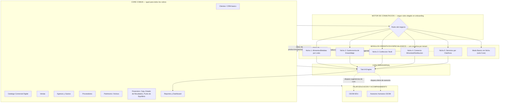
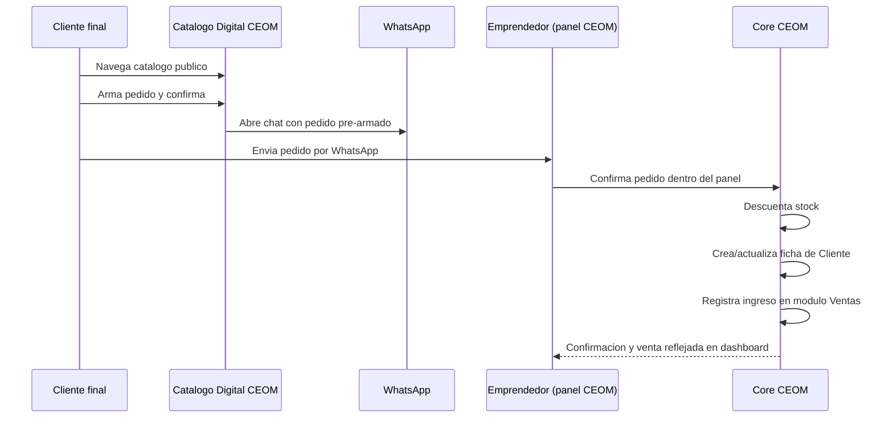
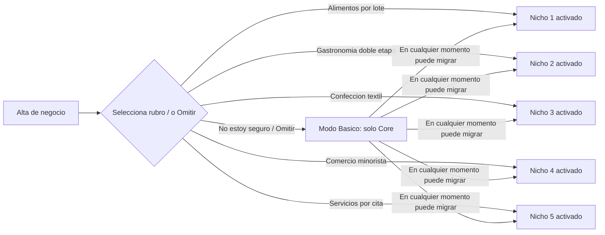
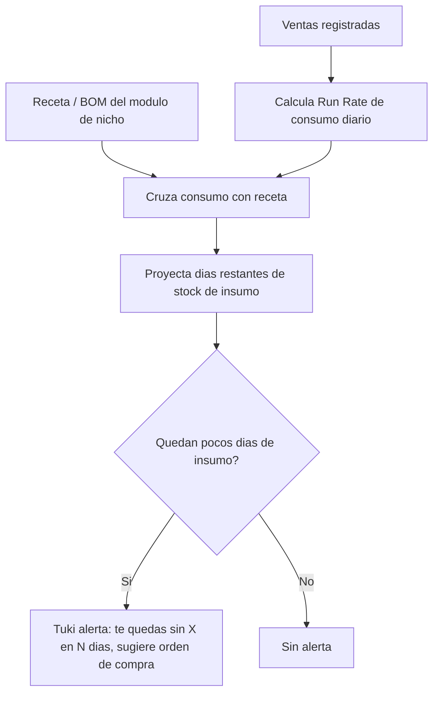
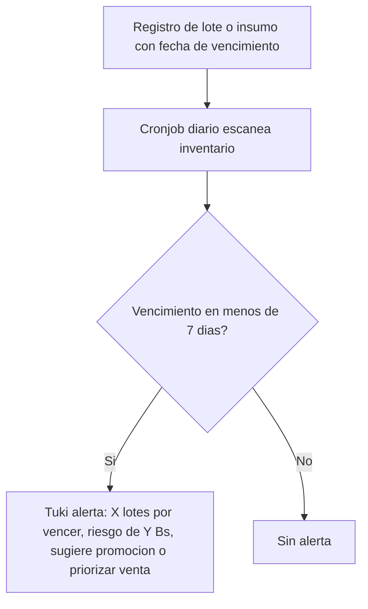

# CEOM — Definición Funcional de Módulos y Funcionalidades (v1)

> **Objetivo de este documento:** antes de diseñar la arquitectura técnica (base de datos, backend, APIs), dejar cerrado el **qué hace el software**: sus módulos, sus funcionalidades y cómo se relacionan entre sí. Es la base sobre la que luego se construirá el diseño técnico.

> **Fuera de alcance de este documento (se dan por sentados, se documentarán aparte):** Autenticación y gestión de sesión, onboarding de adquisición/compra del servicio (checkout, planes, cobros), y la infraestructura de multi-tenancy. Se mencionan solo cuando afectan una decisión funcional (p. ej. qué se ve según el plan contratado).

---

## 1. Principios rectores del producto

Estos principios deben guiar cualquier decisión de qué módulo agregar y cómo diseñarlo:

1. **Cero fricción, primero.** El usuario objetivo va desde el emprendedor neófito en tecnología (que hoy usa una libreta o el Excel "a medias") hasta el que ya usó algún sistema. Toda funcionalidad debe poder usarse sin curva de aprendizaje pesada; lo avanzado se revela progresivamente (progressive disclosure), no se impone desde el día uno.
2. **El Core nunca sabe de negocio.** El núcleo financiero/comercial es agnóstico al rubro. Nada de lógica de "receta", "tela" o "vencimiento" vive en el Core — eso vive exclusivamente en los Módulos Operativos Conmutables.
3. **Todo dato operativo termina en un número financiero.** Cualquier módulo de nicho (una merma, un lote vencido, un retazo de tela) debe poder inyectar su impacto económico al Core (gastos, costos, estado de resultados) sin que el usuario tenga que hacer una segunda transcripción manual.
4. **Tuki como capa de sentido, no como módulo aislado.** Tuki IA no es una pantalla más; es un motor transversal que lee datos de *todos* los módulos (Core + Nicho) y devuelve alertas y sugerencias accionables en lenguaje simple.
5. **Multi-perfil desde el diseño.** El mismo negocio puede ser visto por distintos roles con distinto nivel de detalle: el emprendedor (dueño), un colaborador/vendedor, un asesor/institución que lo acompaña, y el equipo interno de CEOM. El modelo de permisos debe preverse desde lo funcional, aunque el mecanismo técnico se defina después.
6. **Escalonado por plan, nunca por castigo.** Las limitaciones de plan (almacenamiento, nivel de Tuki, número de módulos, etc.) deben sentirse como "el siguiente escalón cuando ya lo necesitás", no como un bloqueo arbitrario.

---

## 2. Vista de alto nivel: Core Común vs. Módulos Operativos Conmutables

**Lectura del diagrama:** el Core es el mismo objeto de base de datos para todos los tenants. En el onboarding (fuera de alcance aquí) el negocio elige su rubro y el backend activa *un* módulo operativo (o el modo básico "N6" si el rubro no encaja en ninguno todavía). Los módulos de nicho **nunca** duplican Ventas, Gastos o Clientes: solo generan eventos que el Core consume. Tuki lee de todo el ecosistema, incluido el pilar de Educación/Acompañamiento.

---

## 3. Perfiles de usuario y qué ve cada uno

Según el Lean Canvas y la reunión con DevBro, hay tres segmentos de cliente + un perfil interno de CEOM. Es clave dejarlo explícito porque **no todos usan los mismos módulos con la misma profundidad**:

| Perfil | Quién es | Qué necesita del sistema | Nivel de Módulos de Nicho |
| --- | --- | --- | --- |
| **Emprendedor en etapa inicial** | Vende por redes/WhatsApp/ferias, sin punto fijo. | Versión liviana: catálogo + WhatsApp + registro financiero simple. | Opcional / activable según rubro (puede vivir bien solo con Core + Catálogo). |
| **Pequeño negocio con punto físico** | Tienda, restaurante, local con atención presencial. | Gestión interna completa + presentación de productos/menú + control de vencimientos/rotación. | Nicho completo activado (1, 2, 3 o 4 según su operación). |
| **Universidad / incubadora / institución** | Acompaña una cartera (cohorte) de emprendimientos. | Panel de seguimiento agregado del avance de "sus" emprendimientos, no gestión operativa propia. | No usa Nichos directamente — usa el **Panel Institucional** (ver sección 8). |
| **Equipo interno CEOM** | Founders/coordinadores (rol tipo Freddy/Caori en la reunión). | Visión global de todos los tenants, salud del negocio, riesgo de abandono. | **Panel de Administración CEOM** (ver sección 9). |

> **Nota de diseño:** el "CRM ligero con sorteo" que mencionan en la reunión (captura de datos del cliente final — cumpleaños, contacto — a cambio de participar en un sorteo semanal) es una funcionalidad pensada específicamente para el perfil **Pequeño negocio con punto físico**. Se detalla como funcionalidad opcional del Core en la sección 4.1, no como módulo de nicho, porque no depende del rubro (aplica igual a una cafetería que a una floristería).

---

## 4. CORE COMÚN — detalle funcional módulo por módulo

### 4.1 Gestión de Clientes (CRM básico)

- Ficha de cliente: nombre, teléfono/WhatsApp, canal de contacto preferido, historial de pedidos y de pagos.
- Alta automática de cliente al registrarse una venta por primer vez desde el Catálogo Digital (no debería requerir doble carga manual).
- **Módulo de fidelización ligera (opcional, para negocios con punto físico):** captura de datos (cumpleaños, preferencias) mediante un mecanismo gamificado tipo sorteo semanal, sin llegar a ser un CRM robusto de marketing. Sirve como semilla de dato para que Tuki, más adelante, sugiera promociones segmentadas.
- Segmentación básica: clientes frecuentes vs. ocasionales, último pedido, ticket promedio.

### 4.2 Presencia Comercial Digital / Catálogo y flujo de venta por WhatsApp

Este es, según la reunión, el corazón de la propuesta comercial (no solo financiera) de CEOM:

- El emprendedor carga productos (nombre, foto, precio, stock disponible) desde su panel.
- El sistema genera un **link público de catálogo** (landing ligera) para poner en bio de Instagram/Facebook/TikTok.
- El cliente final navega el catálogo, arma un pedido y al confirmar es **redirigido a WhatsApp** con el mensaje del pedido pre-armado (sin fricción, sin descargar app).
- Al aceptar el pedido, el emprendedor confirma dentro de CEOM → esto dispara automáticamente: descuento de stock, alta/actualización de cliente, registro del ingreso en Ventas.
- **Funcionalidad complementaria evaluada (ver Preguntas Abiertas):** chatbot 24/7 que responde preguntas frecuentes (precio, disponibilidad) de forma automática antes de escalar a WhatsApp humano. En la reunión se plantea como posible *add-on* de pago aparte, no como parte base.

### 4.3 Ventas

- Registro semiautomático (vía Catálogo/WhatsApp) y manual (venta directa en mostrador, feria, etc.).
- Canal de origen de cada venta (digital / físico / feria / referido).
- Método de pago.
- Consolidado histórico de ventas por producto, por canal, por período.

### 4.4 Egresos y Gastos

- Registro de gasto con tipo: `Fijo`, `Variable No Productivo`, `Único`.
- Asociación opcional a un proveedor (ver 4.5).
- Los costos que **sí** son productivos (insumos de receta, tela consumida, mermas) no se cargan aquí manualmente — llegan automáticamente desde el módulo de nicho correspondiente, para que el emprendedor nunca tenga que registrar el mismo costo dos veces.

### 4.5 Proveedores

- Ficha de proveedor: nombre, contacto, productos/insumos que provee, historial de precios de compra.
- **Alerta de variación de precio:** si el precio de compra de un insumo sube respecto a compras anteriores, queda como dato disponible para que Tuki lo señale (ver Flujo de Tuki en sección 7).
- La creación de Órdenes de Compra formales es una funcionalidad de nicho (ver Nicho 4), pero la ficha de proveedor y el historial de precios son de Core porque todos los rubros compran insumos a alguien.

### 4.6 Patrimonio / Activos

- Registro de activos del negocio: maquinaria, mobiliario, equipos de refrigeración, vehículos, etc.
- Campos clave: costo del activo, vida útil estimada, y — cuando aplica — **capacidad operativa** (ej. `capacidad_almacenamiento` de una heladera, usado en el Flujo C de Tuki).
- Este módulo es el que le da a Tuki los datos físicos (capacidad, límite) que cruza con el ritmo de ventas para detectar cuellos de botella de infraestructura.

### 4.7 Financiero: Flujo de Caja, Estado de Resultados y Punto de Equilibrio

- Consolidación automática de Ventas − Gastos − Costos productivos (inyectados por el módulo de nicho) por período.
- Estado de resultados simple, en lenguaje no contable (evitar jerga de contador; el equipo fue explícito en que **no** quieren ser un sistema contable formal, sino de gestión).
- Cálculo de punto de equilibrio y margen de contribución por producto — insumo directo para el simulador de CEOM EDU (sección 6) y para el discurso de los asesores humanos.
- Este módulo consolida también la métrica clave de negocio mencionada en el Lean Canvas: "cuántos emprendedores llegan a su punto de equilibrio".

### 4.8 Reportes y Dashboard

- Vista resumen para el emprendedor: ventas del período, gasto, margen, alertas activas de Tuki.
- Debe ser el punto de entrada por defecto al iniciar sesión (mobile-first, dado que gran parte del uso descrito en la reunión es desde el celular).

---

## 5. MÓDULOS OPERATIVOS CONMUTABLES — detalle funcional por nicho

Para cada nicho se listan: la lógica de negocio, las pantallas/funcionalidades concretas que necesita el usuario, y qué le "devuelve" al Core.

### Nicho 1 — Alimentos y Bebidas por Lotes (caso SanttiCampo)

- **Lógica:** producción por tanda continua, insumos sufren transformación irreversible (mezcla, pasteurizado, congelado). El cuello de botella típico no es la producción sino el almacenamiento (heladera/freezer con capacidad fija).
- **Funcionalidades:**
  - Definición de **recetas** (insumos y cantidades en litros/gramos por lote base).
  - Registro de **lotes/tandas** producidas: fecha, activo usado, volumen neto obtenido, fecha de vencimiento.
  - Control de **capacidad de almacenamiento** cruzado con el activo de Patrimonio correspondiente (heladera, freezer).
  - Descuento automático de insumos de receta al registrar un lote (impacta Gastos/Costos del Core).
- **Devuelve al Core:** costo de producción por lote, stock de producto terminado con fecha de vencimiento, alertas de capacidad.

### Nicho 2 — Gastronomía de Ensamblaje en Dos Etapas (caso La Nona)

- **Lógica:** producción fraccionada en fases desconectadas en el tiempo (relleno perecedero por la mañana, armado/sellado/horneado por la tarde). Inventario dividido entre "Precocido" (B2B) y "Horneado Final" (venta directa).
- **Funcionalidades:**
  - Estados de producción (`production_stages`) que bloquean/liberan un subproducto hasta que pasa a la siguiente etapa.
  - Doble clasificación de inventario terminado (Precocido vs. Horneado Final), cada uno con su propio precio/canal.
  - Registro de **mermas operativas** (unidades descartadas por rotura o falla de sellado) con motivo, inyectando el costo directamente al Estado de Resultados.
- **Devuelve al Core:** costo de merma como gasto variable, dos SKUs de inventario terminado con reglas de venta distintas.

### Nicho 3 — Confección y Manufactura Textil

- **Lógica:** insumo continuo (rollos de tela en metros) transformado en unidades discretas (prendas) con matriz de variantes Talla/Color/Tipo de Tela. Merma medida en porcentaje de desperdicio de corte, no en unidades rotas.
- **Funcionalidades:**
  - `textile_bom` (lista de materiales): metros de tela, botones, hilo por patrón de costura.
  - Control de stock de rollos de tela con descuento por fracciones lineales (metros).
  - Cálculo de arrastre de costo por metro, incorporando el % de merma de cada tendido de corte.
  - Matriz de variantes para el producto terminado (Talla × Color × Tela).
- **Devuelve al Core:** costo real por prenda (incluyendo merma de corte), stock por variante.

### Nicho 4 — Comercio Minorista y Distribución

- **Lógica:** no hay producción; se compra terminado y se revende. El foco es logística de reabastecimiento, costo de importación/flete, y mermas por vencimiento de anaquel.
- **Funcionalidades:**
  - `purchase_orders`: órdenes de compra formales a proveedores mayoristas (a diferencia del Core, que solo guarda la ficha del proveedor).
  - `landed_costs_calculator`: prorrateo del flete/transporte sobre el costo unitario de cada artículo.
  - Control de lotes por fecha de caducidad para producto de anaquel.
- **Devuelve al Core:** costo unitario real (ya con flete prorrateado), alertas de vencimiento de anaquel.

### Nicho 5 — Servicios por Cita/Hora *(propuesto — ver Preguntas Abiertas)*

No estaba en el reporte original, pero surge como vacío evidente: **no todo emprendimiento vende un producto físico**. Peluquerías, spas, consultorías, clases particulares, talleres, etc. no encajan en ninguno de los 4 nichos actuales (no tienen receta, ni tela, ni reventa de inventario) — su "inventario" es el tiempo de una persona o de un espacio.

- **Lógica propuesta:** el activo que se agota no es materia prima sino **disponibilidad horaria**.
- **Funcionalidades propuestas:**
  - Calendario de servicios/citas con duración por tipo de servicio.
  - Asignación de servicio a un profesional/recurso (si el negocio tiene más de una persona atendiendo).
  - Registro de consumo de insumos menores por servicio (ej. tintura de cabello) — opcionalmente ligado a una versión simplificada de receta.
  - Recordatorios de cita (vía WhatsApp, reutilizando la integración del Core).
- **Devuelve al Core:** ingreso por servicio prestado, tasa de ocupación como métrica para Tuki.

> Se marca como propuesta porque no hay evidencia en los documentos de que el equipo ya lo haya validado con un caso piloto real (como sí existe con SanttiCampo y La Nona). Se incluye para que el equipo decida si lo prioriza o lo deja fuera del MVP.

### Modo Básico (sin nicho)

- Para negocios que no encajan aún en ningún nicho o que están en una etapa tan inicial (ej. "vendo lo que hago en casa, sin receta formalizada") que forzarlos a configurar un módulo operativo sería fricción innecesaria.
- Usan solo Core + Catálogo + Ventas + Gastos manuales. Pueden "graduarse" a un nicho más adelante sin perder su historial.

---

## 6. Pilar de Educación — CEOM EDU

Extraído principalmente de la transcripción de la reunión, ya que el reporte arquitectónico no lo cubría en detalle:

- **Formato:** micro-learning de doble pantalla (video corto + ejercicio/simulación al lado), pensado para consumirse en sesiones cortas.
- **Cuatro verticales de contenido:** Gestión, Marketing Comercial, Finanzas (incluye Finanzas Personales, plegada dentro de Finanzas para no fragmentar en 5 verticales).
- **Acceso escalonado por plan:** el plan básico da acceso a contenido introductorio (ej. finanzas personales aplicadas); planes superiores desbloquean verticales más avanzadas (ej. estrategia empresarial y comercial).
- **Simuladores integrados:** el más mencionado es un simulador de precio/inversión (ej. "si compro un horno adicional, ¿en cuánto tiempo recupero la inversión?"). Estos simuladores deben poder alimentarse de los datos reales del negocio (margen, costos) que ya están en el módulo Financiero del Core, para que la simulación no sea genérica sino aplicada al propio emprendimiento.
- **Modalidad institucional (B2B2C):** convenios con universidades/instituciones para ofrecer cursos gratuitos a sus emprendedores bajo un dominio o acceso institucional propio (mencionado como ej. "SEOM x UPSA/IFI", "SEOM x GDG").

## 7. Pilar de Acompañamiento — Tuki IA y Asesores Humanos

### 7.1 Tuki IA Engine (motor de alertas y sugerencias)

Tuki no es un chat libre suelto: es un motor de reglas + IA que corre en segundo plano sobre los datos del Core y de los módulos de nicho, y entrega mensajes accionables. Del análisis de los documentos surgen (al menos) estos flujos:

**Flujo A — Predicción de desabastecimiento de insumos críticos**

**Flujo B — Vencimiento de lotes / caducidad**

**Flujo C — Cuello de botella de infraestructura / inversión sugerida** (ver detalle matemático completo en el Reporte de Definición Arquitectónica, sección 3, Flujo C — se mantiene igual, no se repite aquí).

**Flujos adicionales propuestos** (no estaban documentados aún, se derivan de la lógica ya definida — para validar con el equipo):

- **Alerta de variación de precio de proveedor:** cuando el costo de compra de un insumo sube significativamente respecto al historial (dato ya contemplado en el módulo Proveedores del Core), Tuki sugiere renegociar o buscar alternativa.
- **Alerta de riesgo de abandono/inactividad:** si un tenant deja de registrar ventas o gastos por N días, Tuki dispara un mensaje de reenganche al usuario **y** una señal visible en el Panel Institucional/CEOM (esto es justamente la necesidad que menciona Kevin/el equipo sobre por qué "7 de 15 emprendimientos" dejaron de presentarse en una cohorte).
- **Sugerencia de curso de CEOM EDU según el problema detectado:** si Tuki detecta, por ejemplo, margen de contribución negativo recurrente, sugiere el módulo de EDU correspondiente antes/además de ofrecer un asesor humano — así se conecta el motor de alertas con el pilar de Educación.

### 7.2 Asesores humanos (marketplace de acompañamiento)

- Desde el panel del emprendedor, se puede **solicitar** una sesión de acompañamiento (estructuración, estrategia comercial, finanzas) con un asesor de CEOM.
- La solicitud debería poder venir pre-cargada de contexto (los mismos datos que ve Tuki), para que el asesor no arranque "en cero" como en un taller genérico.
- Es un servicio adicional de pago (ver Lean Canvas: "Servicios adicionales — Consultorías financieras y comerciales").

## 8. Panel Institucional (universidades, incubadoras, organizaciones)

Funcionalidad claramente pedida en la reunión (rol tipo Freddy/Caori) pero ausente del reporte arquitectónico original:

- Una institución tiene una **cartera** de emprendimientos (ej. "cohorte de 15 emprendimientos, 6 meses").
- Vista agregada, no operativa: avance de configuración inicial, actividad reciente, tendencia de ventas, alertas de inactividad — **no** ve el detalle financiero fino de cada negocio salvo lo que el emprendedor decida compartir.
- Permite comparar el desempeño relativo dentro de la cohorte (quién está creciendo, quién está estancado) para que la institución priorice a quién acompañar.
- Es la base del ingreso institucional B2B (licencias para universidades/incubadoras) del modelo de negocio.

## 9. Panel de Administración interna CEOM

- Visión global de todos los tenants (todos los rubros, todos los planes).
- Salud agregada del negocio CEOM: cantidad de emprendimientos activos, retención, adopción de EDU, uso de Tuki por plan.
- Mismas métricas clave que declara el Lean Canvas (100 emprendimientos en piloto, 70% completa configuración inicial, 60% activos mensuales, 60% retención a 3 meses, 40% completa un módulo de EDU) deberían ser calculables directamente desde este panel.

---

## 10. Requisitos no funcionales clave

- **Mobile-first:** buena parte de los flujos descritos (catálogo, WhatsApp, registrar una venta en el momento) ocurren desde el celular, no desde un escritorio.
- **Sin jerga contable:** lenguaje simple en todo el sistema (evitar términos como "asiento contable"; usar "cuánto gané", "cuánto gasté").
- **Onboarding guiado y progresivo:** dado el público neófito, el alta de un negocio debería poder completarse en pasos mínimos y dejar la configuración fina (recetas completas, matriz de variantes, etc.) para después, sin bloquear el uso básico.
- **Aislamiento de fallos entre nichos:** un error en la lógica de un nicho no debe afectar el Core de otro tenant (principio ya definido en el reporte arquitectónico original).

---

## 11. Preguntas abiertas / puntos a definir con el equipo

Estas son las dudas que surgen de cruzar los documentos — se necesita tu input para cerrar el documento funcional antes de pasar a arquitectura técnica:

1. **Nicho 5 (Servicios por cita/hora):** ¿lo confirman como módulo a incluir en el roadmap, o el foco de los primeros clientes sigue siendo 100% producto físico? Ninguno de los documentos lo menciona explícitamente, pero varios ejemplos reales citados en la reunión (peluquería, consultoría) no encajan en los 4 nichos actuales.
2. **Chatbot 24/7 de atención al cliente:** en la reunión se lo menciona como posible *add-on* de pago aparte, inspirado en una app/bot que vieron. ¿Se mantiene fuera del MVP o entra como funcionalidad del Catálogo Digital desde el inicio?
3. **Nivel de "vista compartida" del Panel Institucional:** ¿la institución ve datos financieros reales del emprendimiento (aunque sea agregados) o solo indicadores de actividad/avance sin cifras de plata? Esto afecta permisos y expectativa de privacidad del emprendedor.
4. **Tuki por plan:** confirmaste en la reunión que el motor de IA detrás de Tuki escalaría de "modelo barato" en el plan básico a "modelo con esteroides" en el plan alto. Para functional-spec: ¿qué cambia exactamente para el usuario en cada nivel — más flujos de alerta, mayor frecuencia de análisis, o conversación más libre (no solo alertas predefinidas)?
5. **Módulo de Proveedores vs. Órdenes de Compra:** en este documento se propuso que la ficha de Proveedor viva en el Core (todos los rubros compran insumos) pero que `purchase_orders` formales sean exclusivas de Comercio Minorista (Nicho 4). ¿Los otros nichos (ej. Confección comprando rollos de tela) también necesitan una orden de compra formal, o les alcanza con el registro simple de Gasto/Proveedor?
6. **Multiplicidad de nichos por negocio:** ¿un mismo negocio puede tener activo más de un módulo operativo a la vez (ej. un restaurante — Nicho 2 — que además revende bebidas embotelladas — Nicho 4)? El reporte original asume un nicho por negocio; conviene confirmarlo antes de fijar el modelo de datos.
7. **CRM con sorteo:** ¿es una funcionalidad del Core disponible para todos, o exclusiva del plan que incluye "punto físico"? Y si el sorteo implica premio real, ¿CEOM necesita alguna lógica de gestión del premio/ganador o es solo captura de datos y el emprendedor gestiona el resto manual?

---

## 12. Siguientes pasos sugeridos

1. Revisar este documento y responder/ajustar la sección 11.
2. Confirmar o descartar el Nicho 5 y decidir si entra en el MVP o en una fase 2.
3. Con el listado de módulos ya validado, pasar a la **definición técnica**: modelo de datos, relaciones Core–Nicho, contratos de API entre el motor de conmutación y cada módulo, y diseño de la capa de permisos multi-perfil (secciones 3, 8 y 9 de este documento).
4. Priorizar el MVP: dado que el Reporte de Definición Arquitectónica original ya recomienda empezar por el **Módulo de Transformación Gastronómica por Lotes** (Nicho 1 y 2, con los casos reales de SanttiCampo y La Nona), este documento no cambia esa recomendación — solo agrega el contexto de los pilares 2 y 3, el Panel Institucional y el Nicho 5 propuesto para que la arquitectura los deje previstos aunque no se construyan primero.