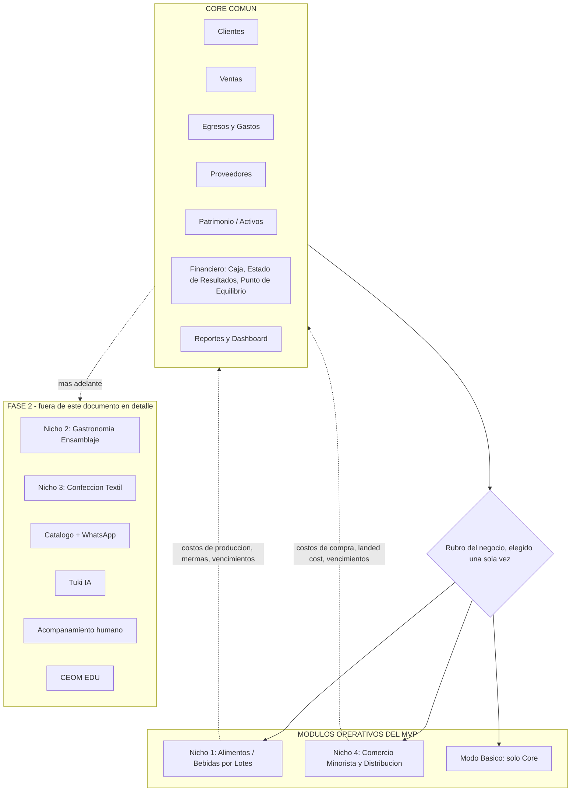
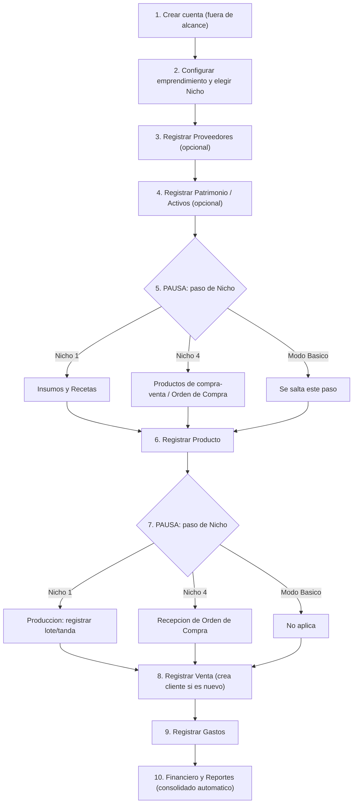

# CEOM - Definición Funcional de Módulos y Funcionalidades (v2 - Enfoque MVP: ERP funcional)

> **Nota de versión:** esta v2 incorpora las correcciones acordadas tras revisar la v1. El cambio principal de enfoque: **este documento ahora describe solo lo que se va a construir en el MVP** (un ERP funcional y sólido para un número acotado de nichos), no la visión completa de CEOM a futuro. Todo lo que se decidió posponer (WhatsApp, Tuki, Acompañamiento, Educación, y algunos nichos) se agrupa aparte en la sección 8, para que quede documentado sin mezclarse con lo que sí se construye ahora.

> **Fuera de alcance de este documento (se dan por sentados, se documentan aparte):** Autenticación y gestión de sesión, checkout/planes/cobros, e infraestructura de multi-tenancy.

---

## 1. Alcance de esta versión (MVP) vs. lo que se posterga

**El objetivo inmediato es dejar un ERP funcional**, con el Core Común sólido y una cantidad acotada de Módulos Operativos Conmutables bien resueltos — no todos los nichos posibles. Sobre esa base funcional, el equipo va a validar la idea con emprendimientos reales antes de sumar las capas de valor agregado (WhatsApp, IA, educación, acompañamiento).

**Entra en el MVP:**
- Core Común completo (Clientes, Ventas, Gastos, Proveedores, Patrimonio, Financiero, Reportes).
- **Nicho 1 — Alimentos y Bebidas por Lotes** (prioridad más alta: es donde hay más ventas validadas — caso SanttiCampo).
- **Nicho 4 — Comercio Minorista y Distribución.**
- **Modo Básico** (negocio sin nicho asignado, solo usa el Core).
- Panel Institucional y Panel de Administración interna CEOM, **a nivel funcional básico** (con el modelo de permisos/consentimiento definido en las secciones 9 y 10 — esto sí se construye desde el MVP porque es un tema de privacidad, no un "extra").

**Se posterga a una fase posterior (ver detalle en sección 8):**
- Integración de Catálogo Comercial Digital + flujo de venta por WhatsApp (costo de API de WhatsApp encarece la suscripción; no es viable para el emprendimiento pequeño que es el primer objetivo).
- Tuki IA Engine (motor transversal de alertas).
- Pilar de Acompañamiento (asesores humanos) — se evalúa implementar al final, si el tiempo lo permite.
- Pilar de Educación (CEOM EDU) — no se construye ahora ni en el corto plazo.
- Nicho 2 (Gastronomía de Ensamblaje en Dos Etapas).
- Nicho 3 (Confección y Manufactura Textil).
- Nicho 5 (Servicios por Cita/Hora) — descartado para esta etapa, no solo pospuesto (ver justificación en sección 8).

---

## 2. Principios rectores del producto

1. **Cero fricción, primero.** El público va desde el neófito en tecnología hasta el que ya usó algún sistema. El alta del negocio y la carga de datos deben sentirse como una secuencia lógica y progresiva, nunca como un formulario gigante.
2. **El Core nunca sabe de negocio.** El núcleo financiero/comercial es agnóstico al rubro. La lógica de "receta" o "landed cost" vive exclusivamente en el Módulo Operativo del Nicho correspondiente.
3. **Todo dato operativo termina en un número financiero.** Un lote producido, una compra recibida, una merma — todo debe reflejarse automáticamente en Gastos/Costos del Core, sin doble carga manual.
4. **Un negocio, un Nicho.** No existe la multiplicidad de nichos por negocio (ver sección 7.3 para el detalle de esta decisión y cómo se resuelven los casos mixtos).
5. **Privacidad por defecto.** Ningún tercero (institución, incubadora, ni siquiera el propio equipo de CEOM) puede ver el detalle de un emprendimiento sin que ese emprendimiento lo haya aprobado explícitamente (ver secciones 9 y 10).

---

## 3. Vista de alto nivel: Core Común vs. Módulos Operativos del MVP

---

## 4. Perfiles de usuario

| Perfil | Quién es | Qué necesita del ERP | Nicho típico |
| --- | --- | --- | --- |
| **Emprendedor** | Dueño del negocio. | Gestión operativa y financiera de su propio negocio, un solo nicho asignado. | Nicho 1, Nicho 4 o Modo Básico. |
| **Institución (universidad/incubadora/organización)** | Acompaña una cartera de emprendimientos. | Panel de seguimiento agregado, **solo de los emprendimientos que lo aprobaron explícitamente** (ver sección 9). | No usa Nichos — usa el Panel Institucional. |
| **Equipo interno CEOM** | Founders/coordinadores. | Visión global y salud de la plataforma; detalle de un emprendimiento puntual **solo si fue aprobado** (ver sección 10). | Panel de Administración CEOM. |

---

## 5. Flujo secuencial de alta y operación del negocio

Este es el recorrido real, paso a paso, desde que se crea el negocio hasta que se ve reflejado en los reportes financieros. Donde un paso pertenece a un Módulo Operativo (Nicho) y no al Core, se marca explícitamente con una pausa — el detalle completo de ese paso está en la sección 7, no se repite acá.

1. **Crear cuenta** *(fuera de alcance de este documento — autenticación)*.
2. **Configurar el emprendimiento (Core):** nombre del negocio, ciudad, moneda, y **selección del rubro/Nicho** — este es el punto donde se decide, de una vez y para siempre por ahora, si el negocio opera bajo Nicho 1, Nicho 4 o Modo Básico.
3. **Registrar Proveedores (Core, opcional en este punto):** ficha básica de a quién se le compra. Se puede completar después, no bloquea el resto del flujo.
4. **Registrar Patrimonio/Activos (Core, opcional en este punto):** equipos, mobiliario, capacidad instalada cuando aplica (ej. capacidad de una heladera). Igual que Proveedores, se puede completar más adelante.
5. **⏸ PAUSA — esto ya es un paso de Nicho, no de Core:**
   - Si el negocio es **Nicho 1**: acá se cargan **Insumos** (con costo unitario) y se definen **Recetas** — el detalle completo está en la sección 7.1.
   - Si el negocio es **Nicho 4**: acá no hay insumos ni recetas — en cambio se configuran directamente los **Productos de compra-venta** y se puede emitir una **Orden de Compra** — el detalle completo está en la sección 7.2.
   - Si es **Modo Básico**: este paso no existe, se salta directo al siguiente.
6. **Registrar Producto (Core, con datos que le entrega el Nicho):**
   - Nicho 1: el producto queda ligado a una receta; el costo variable se calcula solo, a partir del costo de los insumos.
   - Nicho 4: el producto queda ligado a una compra; el costo unitario ya incluye el landed cost (flete prorrateado).
   - Modo Básico: el producto se carga con costo y precio directamente, sin cálculo automático.
7. **⏸ PAUSA — paso de Nicho:**
   - Nicho 1: **Producción** — se registra el lote/tanda (fecha, activo usado, volumen obtenido, fecha de vencimiento). Esto descuenta insumos automáticamente y calcula el costo real del lote (sección 7.1).
   - Nicho 4: **Recepción de Orden de Compra** — el pedido llega, se registra el ingreso a inventario ya con el costo prorrateado (sección 7.2).
   - Modo Básico: no aplica, el producto ya quedó listo para vender en el paso 6.
8. **Registrar una Venta (Core):** se elige el producto, se descuenta stock. Si el cliente es nuevo, **se crea su ficha ahí mismo, en el momento de la venta** (nombre y teléfono como mínimo) — no hace falta un alta de cliente por separado.
9. **Registrar Gastos (Core):** todo lo que no sea costo productivo (alquiler, servicios, comisiones) se carga acá como `Fijo`, `Variable No Productivo` o `Único`.
10. **Ver Financiero y Reportes (Core):** todo lo anterior se consolida solo — caja, estado de resultados, margen por producto, punto de equilibrio. El emprendedor no vuelve a cargar nada de esto manualmente.

---

## 6. Core Común — detalle funcional módulo por módulo

### 6.1 Gestión de Clientes
- Ficha mínima: nombre, teléfono, historial de compras.
- Se crea en el momento de una venta (paso 8 del flujo), no requiere alta separada.
- Segmentación básica: frecuente vs. ocasional, último pedido, ticket promedio.

### 6.2 Ventas
- Registro manual de venta (mostrador, feria, pedido directo). El canal digital/WhatsApp queda para Fase 2 (sección 8).
- Descuenta stock del producto vendido.
- Consolidado histórico por producto y por período.

### 6.3 Egresos y Gastos
- Tipo: `Fijo`, `Variable No Productivo`, `Único`.
- Asociación opcional a un Proveedor.
- Los costos productivos (insumos, compras) **no** se cargan acá manualmente: llegan automáticos desde el módulo de Nicho.

### 6.4 Proveedores
- Ficha: nombre, contacto, insumos/productos que provee, historial de precios de compra.
- Es de Core porque todo rubro compra a alguien; la Orden de Compra formal, en cambio, es específica de Nicho 4 (ver sección 12, pregunta abierta sobre reglas por nicho).

### 6.5 Patrimonio / Activos
- Registro de activos: maquinaria, mobiliario, equipos.
- Campo de capacidad operativa cuando aplica (ej. capacidad de almacenamiento de una heladera) — el dato queda disponible para uso futuro (Tuki, Fase 2), pero el registro del dato es del MVP.

### 6.6 Financiero: Caja, Estado de Resultados y Punto de Equilibrio
- Consolidación automática: Ventas − Gastos − Costos productivos (inyectados por el Nicho).
- Lenguaje simple, no contable formal.
- Cálculo de margen por producto y punto de equilibrio.

### 6.7 Reportes y Dashboard
- Vista resumen: ventas del período, gasto, margen.
- Punto de entrada por defecto al iniciar sesión, pensado mobile-first.

---

## 7. Módulos Operativos Conmutables del MVP

### 7.1 Nicho 1 — Alimentos y Bebidas por Lotes

- **Lógica:** producción por tanda continua; los insumos sufren una transformación irreversible (mezcla, pasteurizado, congelado).
- **Funcionalidades:**
  - **Insumos:** carga de materia prima con costo unitario.
  - **Recetas:** composición exacta del lote base (insumos y cantidades en litros/gramos).
  - **Producción (lotes/tandas):** fecha, activo utilizado, volumen neto obtenido, fecha de vencimiento. Descuenta insumos automáticamente y calcula el costo real del lote.
  - **Capacidad de almacenamiento:** cruce simple entre stock de producto terminado y la capacidad del activo de Patrimonio correspondiente (sin alertas automáticas todavía — eso es Tuki, Fase 2 — pero el dato queda disponible para consulta).
- **Devuelve al Core:** costo de producción por lote, stock de producto terminado con vencimiento.

### 7.2 Nicho 4 — Comercio Minorista y Distribución

- **Lógica:** no hay producción; se compra terminado y se revende. El foco es reabastecimiento y costo de traer el producto hasta el negocio.
- **Funcionalidades:**
  - **Productos de compra-venta:** sin receta, se cargan directamente.
  - **Órdenes de Compra:** pedidos formales a proveedores mayoristas.
  - **Landed cost:** prorrateo del flete/transporte sobre el costo unitario de cada artículo al recibir la orden.
  - **Control de vencimiento de anaquel** para producto con fecha de caducidad.
- **Devuelve al Core:** costo unitario real (ya con flete prorrateado), alertas de vencimiento de anaquel (dato disponible, sin automatización todavía).

### 7.3 Un negocio, un Nicho — cómo se resuelven los casos mixtos

Quedó claro que **no** va a existir un negocio con más de un Nicho activo a la vez. Pero eso deja una pregunta real por resolver: ¿qué pasa con un negocio que, dentro de su operación normal, tiene una parte que "produce" y otra parte que simplemente "revende sin transformar"? Ejemplo: un negocio de Nicho 1 que también compra y revende algún producto terminado (vasos, botellas, algún insumo de terceros) sin procesarlo.

**Propuesta a validar con el equipo** (no implementada todavía, es una definición pendiente): en vez de forzar un segundo Nicho, cada Nicho podría permitir marcar un producto como **"de reventa simple"** dentro del mismo módulo — es decir, un producto que no pasa por Receta/Producción (Nicho 1) ni por el flujo completo de Landed Cost (Nicho 4), sino que se carga con costo y precio directo, igual que en Modo Básico. Así el negocio sigue teniendo un solo Nicho, pero ese Nicho contempla tanto su proceso principal como los productos que simplemente revende sin transformar.

Esto se deja marcado como pendiente de definición conjunta — ver sección 12.

### 7.4 Modo Básico (sin nicho)

- Para negocios que todavía no encajan en Nicho 1 o Nicho 4, o que están en una etapa muy inicial.
- Usa solo Core: Ventas, Gastos, Clientes, Reportes. Producto se carga con costo y precio directo, sin receta ni landed cost.
- Puede migrar a un Nicho más adelante sin perder su historial (el mecanismo de migración es una definición técnica pendiente, no funcional).

---

## 8. Fuera del MVP — documentado para más adelante (Fase 2)

Se deja registrado acá para no perder el trabajo ya hecho, pero **no se detalla a nivel funcional en esta versión** — se retoma cuando el ERP base esté validado con emprendimientos reales.

- **Catálogo Comercial Digital + flujo de venta por WhatsApp:** motivo de la postergación — el costo de la API de WhatsApp eleva el costo de la suscripción, y el primer segmento objetivo son emprendimientos pequeños que no pueden asumir ese costo todavía. Se retoma como funcionalidad "plus" más adelante.
- **Tuki IA Engine:** el motor de alertas (desabastecimiento, vencimientos, cuellos de botella de infraestructura) descrito en el Reporte de Definición Arquitectónica original sigue siendo válido como visión, pero se implementa en la versión siguiente al MVP, junto con el resto de funcionalidades de IA.
- **Pilar de Acompañamiento (asesores humanos):** se evalúa incorporar al final del desarrollo del MVP, si el tiempo lo permite. No es un compromiso cerrado.
- **Pilar de Educación (CEOM EDU):** no se construye ahora ni en el corto plazo. Queda fuera de este ciclo de planeamiento.
- **Nicho 2 — Gastronomía de Ensamblaje en Dos Etapas** (caso La Nona): no se implementa en el MVP. La lógica de estados de producción y mermas operativas documentada en el Reporte de Definición Arquitectónica se mantiene como referencia para cuando se retome.
- **Nicho 3 — Confección y Manufactura Textil:** no se implementa en el MVP.
- **Nicho 5 — Servicios por Cita/Hora:** se descarta para esta etapa (no solo se pospone). La razón: CEOM es un ERP que hace seguimiento de un proceso operativo con inventario/producción/venta de punto físico o digital; un negocio de servicios por hora no tiene ese proceso que seguir de la misma forma, así que forzarlo ahora sería construir algo fuera del núcleo del producto. Puede reevaluarse en el futuro si el modelo de servicios se vuelve prioritario.

---

## 9. Panel Institucional — modelo de visibilidad y consentimiento

Corrección importante respecto a la v1: **ninguna institución (universidad, incubadora, organización) puede ver los datos de un emprendimiento por defecto.**

**Regla de doble consentimiento:**
1. La institución marca/solicita seguimiento sobre un emprendimiento (por ejemplo, porque es parte de una cohorte que acompaña).
2. El emprendimiento tiene que **aprobar explícitamente** que esa institución específica vea sus datos.
3. Solo cuando **ambas condiciones** se cumplen, la institución puede ver el detalle de ese emprendimiento en su panel. Si falta cualquiera de las dos, no hay visibilidad.

**Nivel de detalle (por ahora, sujeto a revisión):** una vez aprobado, la institución ve **datos financieros reales** del emprendimiento (no solo indicadores de actividad). Más adelante se van a agregar reglas más finas para que tanto el emprendimiento como la institución puedan activar/desactivar qué partes específicas se comparten — eso queda pendiente de definir (sección 12), no es parte del MVP funcional inicial.

---

## 10. Panel de Administración interna CEOM

- Visión agregada de la plataforma (cantidad de emprendimientos activos, uso general) — esto **no** requiere aprobación individual porque es información agregada/anónima, no el detalle de un emprendimiento puntual.
- **La misma regla de consentimiento de la sección 9 aplica acá:** el equipo de CEOM tampoco puede entrar al detalle de un emprendimiento específico sin que ese emprendimiento lo haya aprobado explícitamente. CEOM no tiene un acceso privilegiado por ser el dueño de la plataforma.

---

## 11. Requisitos no funcionales clave

- **Mobile-first:** el registro de ventas y la consulta de reportes deben poder hacerse cómodamente desde el celular.
- **Sin jerga contable:** lenguaje simple en todo el sistema.
- **Onboarding progresivo:** los pasos 3 y 4 del flujo de la sección 5 (Proveedores, Patrimonio) son opcionales al momento de la configuración inicial — no deben bloquear que el negocio empiece a vender.
- **Aislamiento de fallos entre nichos:** un error en la lógica de un nicho no debe afectar el Core de otro tenant.

---

## 12. Preguntas abiertas / puntos a definir con el equipo

1. **Definición de "producto de reventa simple" dentro de un mismo Nicho** (sección 7.3): ¿se construye como una funcionalidad transversal disponible en cualquier Nicho, o se define caso por caso qué puede y qué no puede complementarse dentro de Nicho 1 y Nicho 4? Se necesita revisar ejemplos reales concretos del equipo para cerrar esto antes de pasar a diseño técnico.
2. **Reglas de Proveedores vs. Órdenes de Compra por Nicho:** se definirán más adelante, una vez que el ERP a grandes rasgos esté validado — queda marcado como pendiente, no bloqueante para avanzar con el resto del documento.
3. **Reglas granulares de visibilidad del Panel Institucional** (qué partes específicas se pueden activar/desactivar más allá del "todo o nada" con aprobación): se define en una etapa posterior.
4. **Mecanismo de migración de Modo Básico a un Nicho:** funcionalmente se acepta que un negocio pueda migrar, pero cómo se preserva el historial es una definición que corresponde más a la etapa de diseño técnico que a este documento funcional.

---

## 13. Siguientes pasos sugeridos

1. Validar la sección 7.3 (casos mixtos dentro de un mismo Nicho) con ejemplos reales del equipo.
2. Con el Core y los dos Nichos del MVP (1 y 4) ya cerrados a nivel funcional, pasar a la **definición técnica**: modelo de datos, relación Core–Nicho, y el modelo de permisos de las secciones 9 y 10.
3. Todo lo agrupado en la sección 8 queda documentado pero no se toca hasta que el ERP base esté validado con emprendimientos reales.